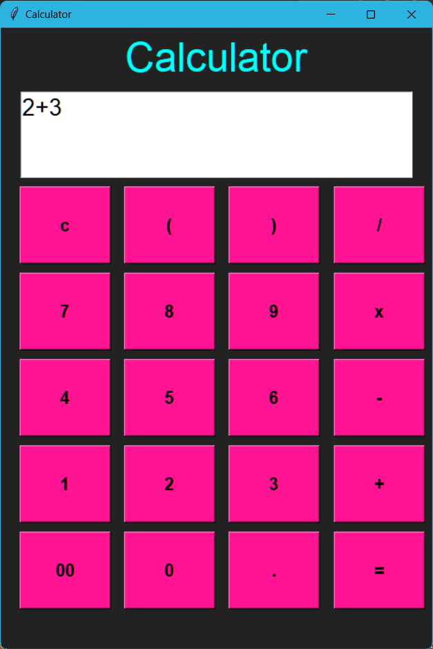

# CodeClause_Calculator
<h1>Calculator</h1>
This is a simple calculator application built using Python and tkinter. The application provides basic arithmetic operations such as addition, subtraction, multiplication, and division, and also supports parentheses and decimal points.

<h2>How to use the calculator</h2>

1.Install Python 3 on your computer. 
2.Run the following command to start the calculator: 
     python calculator.py
3.The calculator window will open. 
4.Use the buttons to enter the numbers and operations you want to perform. 
5.Click the "=" button to see the result. 
6.Click the "c" button to clear the calculator.

<h2>Sample Outpur</h2>

